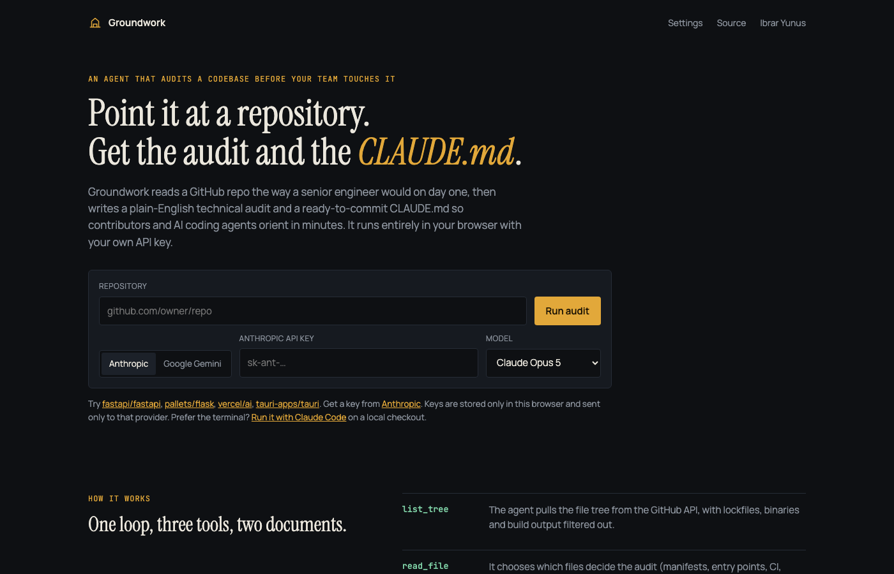

<h1 align="center">Groundwork</h1>

<p align="center">
  <strong>An agent that audits a codebase before your team — or your AI coding agents — touch it.</strong><br>
  Point it at a GitHub repository. Get a plain-English technical audit and a ready-to-commit <code>CLAUDE.md</code>.
</p>

<p align="center">
  <a href="https://groundwork-audit-iy.web.app">Live app</a> ·
  <a href="#claude-code-cli">Claude Code CLI</a> ·
  <a href="#how-it-works">How it works</a> ·
  <a href="#run-locally">Run locally</a>
</p>

<p align="center">
  
  
  
</p>

<p align="center">
  
</p>

---

## Why

The first day on an unfamiliar codebase is spent answering the same questions: what is this, how do I run it, what will bite me, and what must I never do here. A second contributor asks them again. An AI coding agent asks them on every session, and gets them wrong when nobody wrote the answers down.

Groundwork does that first day in a couple of minutes and writes the answers down in the two forms people actually use:

| Document | For | Contains |
|---|---|---|
| **Audit report** | founders and engineers | verdict, stack, strengths, risks with severity and file evidence, what is missing for a team, first five actions |
| **CLAUDE.md** | Claude Code, Cursor, new contributors | purpose, install/run/test/lint commands, repo map, observed conventions, hard rules, where config and secrets come from, how to verify a change |

## How it works

Groundwork is a tool-using agent, not a summariser. The model plans, calls tools, reads what it decides it needs, and is only allowed to exit through `finish`, which must return both documents.

```
                ┌──────────────────────────────────────────────┐
  repo URL ───▶ │  loop (src/agent/index.ts)                    │
                │    ├─ list_tree   ──▶ GitHub trees API        │
                │    ├─ read_file   ──▶ raw.githubusercontent   │  ◀── ≤ ~18 files, 14 KB each
                │    └─ finish      ──▶ { report, claude_md }   │
                └──────────────┬───────────────────────────────┘
                               │  one Session interface
                 ┌─────────────┴─────────────┐
                 ▼                           ▼
        Anthropic (official SDK,      Google Gemini (REST,
        browser mode, tool use,       function calling)
        prompt caching)
```

- **One prompt, one tool schema** (`src/agent/prompt.ts`) drives every provider. Providers only translate the wire format.
- **A budget, not a vibe.** The system prompt gives the agent a step budget and a file budget and tells it to say "not visible in the repo" rather than guess. Lockfiles, binaries and build output are filtered before the model ever sees the tree.
- **Every tool call is shown.** The trace panel lists what was read, how long it took, and the model's reasoning between calls, so you can judge the audit by what it looked at.
- **Nothing leaves your browser** except requests to GitHub and the provider you chose. There is no server, no analytics, and keys live in `localStorage` only.

## Providers

| Provider | Models | Notes |
|---|---|---|
| Anthropic | Claude Opus 5 · Claude Sonnet 5 · Claude Haiku 4.5 | Official `@anthropic-ai/sdk` with `dangerouslyAllowBrowser`; strict tool schemas; the system prompt is cached across steps. |
| Google Gemini | Gemini 2.5 Pro · Gemini 2.5 Flash | REST function calling with `mode: ANY`, so the model cannot answer in prose. |

Get a key from the [Anthropic Console](https://console.anthropic.com/settings/keys) or [Google AI Studio](https://aistudio.google.com/apikey). A GitHub token is optional; add one in Settings for private repositories or a higher rate limit.

## Claude Code CLI

Already inside a repository with [Claude Code](https://docs.anthropic.com/en/docs/claude-code) installed? Run the same audit on the local checkout with no API key at all. Claude Code's own `Read`, `Glob` and `Grep` tools replace the GitHub API.

```bash
node cli/groundwork.mjs ~/code/some-repo            # defaults to opus
node cli/groundwork.mjs ~/code/some-repo --model sonnet
```

Output goes to `.groundwork/audit.md` and `.groundwork/CLAUDE.md` inside the target repo. Review, then `cp .groundwork/CLAUDE.md ./CLAUDE.md`. The runner is read-only: it allows exactly three tools and never edits or executes anything.

## Run locally

```bash
pnpm install
pnpm dev
```

Typecheck and build (what CI runs):

```bash
pnpm exec tsc -p tsconfig.app.json --noEmit && pnpm build
```

Deploy to Firebase Hosting:

```bash
pnpm build && firebase deploy --only hosting
```

## Project layout

```
src/agent/prompt.ts      system prompt + tool specs (single source of truth)
src/agent/providers.ts   Anthropic and Gemini sessions behind one interface
src/agent/github.ts      tree + file access, skip filter, rate-limit handling
src/agent/index.ts       the loop; emits AgentEvents to the UI
src/App.tsx              UI: launch form, trace, report/CLAUDE.md tabs, history
cli/groundwork.mjs       Claude Code headless runner
```

## Limitations

- Public repositories only, unless you supply a GitHub token.
- Very large monorepos are truncated by the GitHub tree API; the agent is told when that happens.
- The audit is only as good as the ~18 files the agent chooses to read. The trace tells you which ones.

## License

MIT. Built by [Ibrar Yunus](https://ibraryunus.com/ai-engineer).
